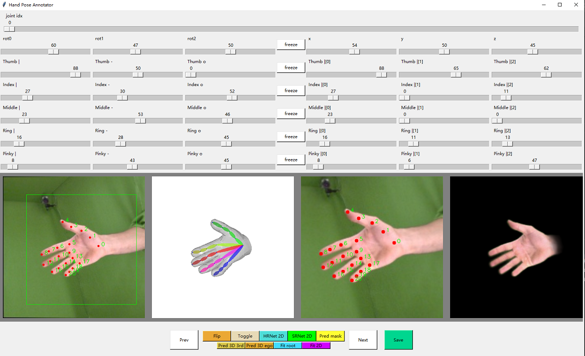
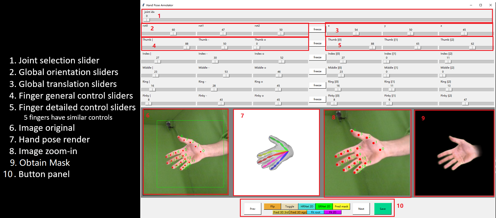

# Annotations Tools


本仓库修改自[3D Hands for All](https://github.com/AlextheEngineer/3DHandsForAll),感谢原作者开源的这项工作！

本仓库介绍了一种三维手姿势调整工具，只需单张RGB图像就可以进行姿势的注释及调整。该工具能够提供任意数量的2D关键点，并自动优化MANO手姿势以适合提供的关键点。它还允许控制所有关节旋转（具有物理约束），以实现更精细的注释。此外，该仓库集成了预训练的2D和3D模型，支持自动注释，目前[HRNet] 和 [SRHandNet]()已经成功部署，并集成了用于估计mask的[SegNet]。然而，网络估计的二维/三维关键点可能并不是特别理想，因此可能需要手动调整以获得更高的精度。

## 环境配置及模型下载
1. 下载[MANO](https://github.com/hassony2/manopth),并将根文件夹移动到“models/MANO_layer”。“setup.py”文件应位于"models/MANO_layer/manopth/setup.py"。将anaconda命令行切换至与“setup.py”同级目录，然后运行：
  > pip install .

2. 下载MANO pickle
- Go to [MANO website](http://mano.is.tue.mpg.de/)
- Create an account by clicking *Sign Up* and provide your information
- Download Models and Code (the downloaded file should have the format `mano_v*_*.zip`). Note that all code and data from this download falls under the [MANO license](http://mano.is.tue.mpg.de/license).
- unzip and copy the `models` folder into the `manopth/mano` folder
- Your folder structure should look like this:
```
manopth/
  mano/
    models/
      MANO_LEFT.pkl
      MANO_RIGHT.pkl
      ...
  manopth/
    __init__.py
    ...
```

3. 下载需要用到的权重文件，并把它们移动至：“models_saved”目录下；

* 在线下载
  > Model 2D (https://byu.box.com/s/ygpnrc7d4a6lh7pxoktdaecc0tk4473m); Model 3D 3rd-person (https://byu.box.com/s/tigqgfruupnb6hodkms63qfqwal9xmp8); Model 3D egocentric (https://byu.box.com/s/byznwg5lvi7c4qmhre2g0fkbrnd7nxd0)

* 网盘下载

## 怎么使用


运行以下命令从各种数据集中加载示例图像，可以看到如下GUI界面
  > python pose_annotator.py

原始图像填充为正方形（如图6所示），渲染得到的手与图像分辨率匹配（如图7所示），我们的目标是生成与图像中的手匹配的MANO手模型。由于摄像机内参未知，因此生成的MANO-hand全局3D关节位置基于渲染摄像机的内参。

* 目前这个仓库只支持右手，如果相对左手进行标记，可以点击“Flip”按钮；在保存时，手的手性会被记录在文件名中

### 2D Keypoints Annotation
  * 手动模式

虽然使用控制关节旋转（例如#2、#4、#5）和根关节位置（#3）的滑块可以控制MANO参数，但为了尽量减少手动注释的需要，该工具允许使用者首先使用关节选择滑块（#1），然后单击原始图像（#6）或放大图像（#8），对二维关键点进行注释。要选择放大区域，只需右键单击原始图像（#6）并滚动以调整裁剪大小。

  * 自动模式

为了简化二维关键点注释过程，我们在Ego2HandsPose、HIU-DMTL和FreiHand上预训练了HRNet。要自动预测2D关键点，只需提供手部检测边界框并单击“Pred 2D”。可能需要手动进一步调整某些关键点。

### 3D Hand Fitting
  * 手动模式

给定任意数量的带注释的二维关键点，请执行以下步骤：

1. 按钮“Fit root”仅使用腕关节fitting手（关节#0需要注释）

2. 要从默认姿势调整MANO手，首先需要调整全局方向滑块（如#2所示），以给手一个良好的初始点。

3. 有了一个好的初始姿势，然后可以单击“Fit 2D”，在给定注释的2D关键点的情况下，将下降梯度到全局最小值。由于缺乏深度信息，有时对于同一组2D关键点有两种可行的解决方案。在这种情况下，可以手动旋转手指以更接近真实解，然后按“Fit 2D”。

4. 使用 "Toggle" 按钮查看渲染的手是否与图像中的手很好地重叠。当自动拟合不能产生完美的解决方案时，用户始终可以手动调整关节旋转以进行一些小的最终调整。

5. 使用手动细化进行最终微调。对于每个手指的详细控制，左侧的3个滑块控制特定手指第一个关节的3D旋转（如#4所示）。右侧的3个滑块控制特定手指第一、第二和第三个关节的1D旋转。

  * 自动模式

为了简化整个拟合过程，我们在MANO3DHands上预训练了一个用于三维标准位姿估计的自定义Resnet。提供手部检测框后，您只需单击“Pred 3D 3rd”或“Pred 3D ego”（分别在MANO3DHands的第三人称和自我中心版本上训练）即可自动预测2D关键点、3D规范关键点，并fitting手部。“Pred 3D 3rd”通常适用于所有视点；“Pred 3D自我”更适合以自我为中心的视点。根据2D/3D估计精度，可能需要手动细化。

### 最终验证
从单个视图检查3D pose时比较困难的。要从其他视图验证手的姿势，请单击全局方向滑块（#2）旁边的“冻结”按钮。现在可以自由更改全局方向，从不同角度查看手的姿势。验证后，单击“恢复”按钮以恢复先前保存的全局方向。

### 保存
要保存手部姿势，请单击“save”按钮，该按钮将在输入图像的同一目录中保存MANO参数文件、3D全局关节位置和2D图像关节位置。

  * MANO file

MANO一共51维. 前3个值包含全局3D根关节位置（x：向右增加。y：向下增加。z：远离相机原点增加）；接下来的3个值表示手姿势的全局方向（根关节的旋转值）；其余45个值表示15个手关节的旋转（指尖没有旋转）

  * 3D Global Keypoints file

该数组的形状为[21，3]，其中包含所有21个关节的三维全局关节位置（以厘米为单位）。

  * 2D Global Keypoints file

该数组的形状为[21，2]，其中包含所有21个关节的2D关节位置（行和列用百分比表示，因此它们对图像缩放不变）。

## License
This tool can be used freely for scientific or commercial purposes. If you use this tool for data annotation of your research, please cite the corresponding [paper](https://arxiv.org/abs/2206.04927).
